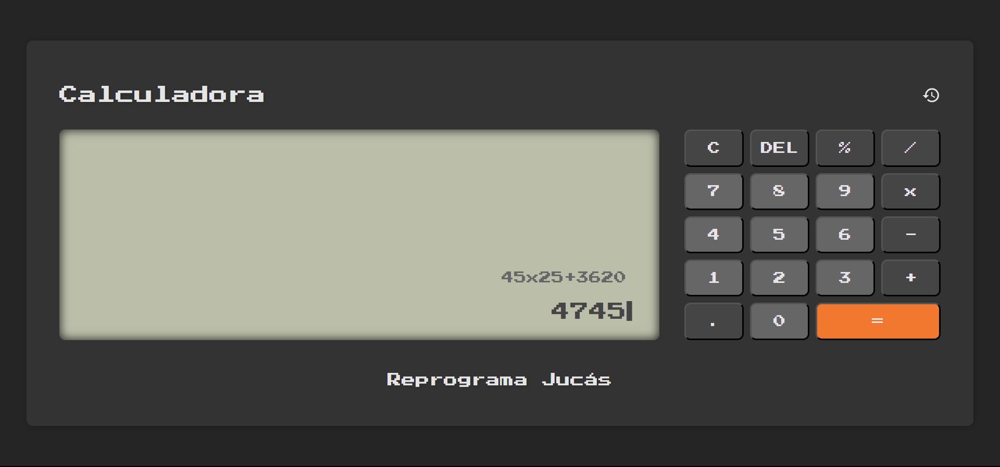

# Calculator

Este projeto foi desenvolvido na conclusão do módulo de JavaScript do curso de [Desenvolvimento Web](https://github.com/PabloAlencar7/Web-Development-Course). A Calculadora é uma aplicação que consegue resolver expressões com múltiplas operações e registrar seu histórico.

## Tecnologias Utilizadas

- HTML
- CSS
- JavaScript

## Links

- [Deploy](https://github.com/PabloAlencar7/Calculator)